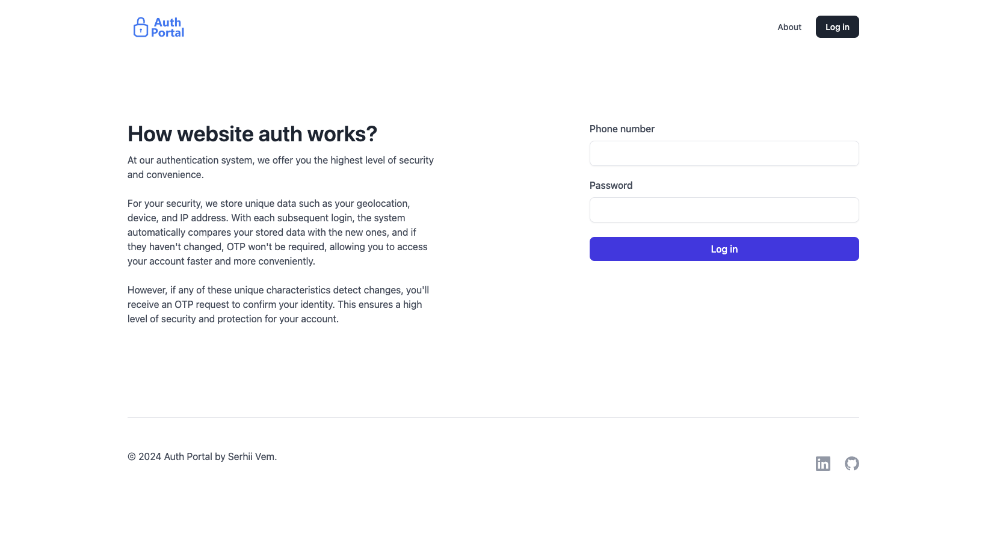

## Project demo

https://auth-otp-optimization.vercel.app/login



## Getting Started

First, build the project:

```bash
npm install
# or
yarn
```

Add, process.env variables:

```.env.local
twilioAccountSid=
twilioAuthToken=
twilioPhone=

apiKey=
authDomain=
databaseURL=
projectId=
storageBucket=
messagingSenderId=
appId=
measurementId=

JWTSecretKey=
```

Then, run the development server:

```bash
npm run dev
# or
yarn dev
```

Open [http://localhost:3000](http://localhost:3000) with your browser to see the result.
